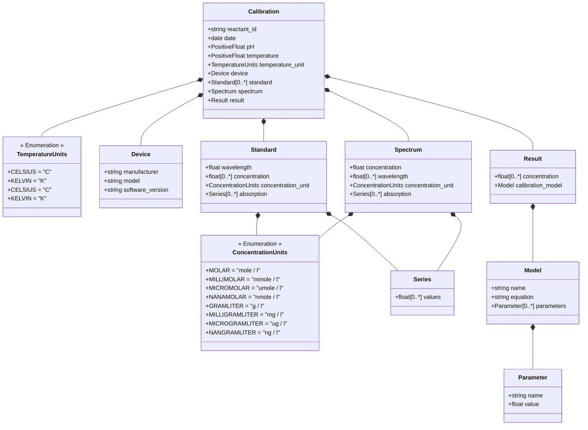

```mermaid
classDiagram
    Calibration *-- TemperatureUnits
    Calibration *-- Device
    Calibration *-- Standard
    Calibration *-- Spectrum
    Calibration *-- Result
    Standard *-- ConcentrationUnits
    Standard *-- Series
    Spectrum *-- ConcentrationUnits
    Spectrum *-- Series
    Result *-- Model
    Model *-- Parameter
    
    class Calibration {
        +string reactant_id
        +date date
        +PositiveFloat pH
        +PositiveFloat temperature
        +TemperatureUnits temperature_unit
        +Device device
        +Standard[0..*] standard
        +Spectrum spectrum
        +Result result
    }
    
    class Device {
        +string manufacturer
        +string model
        +string software_version
    }
    
    class Standard {
        +float wavelength
        +float[0..*] concentration
        +ConcentrationUnits concentration_unit
        +Series[0..*] absorption
    }
    
    class Spectrum {
        +float concentration
        +float[0..*] wavelength
        +ConcentrationUnits concentration_unit
        +Series[0..*] absorption
    }
    
    class Result {
        +float[0..*] concentration
        +Model calibration_model
    }
    
    class Model {
        +string name
        +string equation
        +Parameter[0..*] parameters
    }
    
    class Parameter {
        +string name
        +float value
    }
    
    class Series {
        +float[0..*] values
    }
    
    class TemperatureUnits {
        << Enumeration >>
        +CELSIUS = "C"
        +KELVIN = "K"
    }
    
    class TemperatureUnits {
        << Enumeration >>
        +CELSIUS = "C"
        +KELVIN = "K"
    }
    
    class ConcentrationUnits {
        << Enumeration >>
        +MOLAR = "mole / l"
        +MILLIMOLAR = "mmole / l"
        +MICROMOLAR = "umole / l"
        +NANAMOLAR = "nmole / l"
        +GRAMLITER = "g / l"
        +MILLIGRAMLITER = "mg / l"
        +MICROGRAMLITER = "ug / l"
        +NANGRAMLITER = "ng / l"
    }
    
```