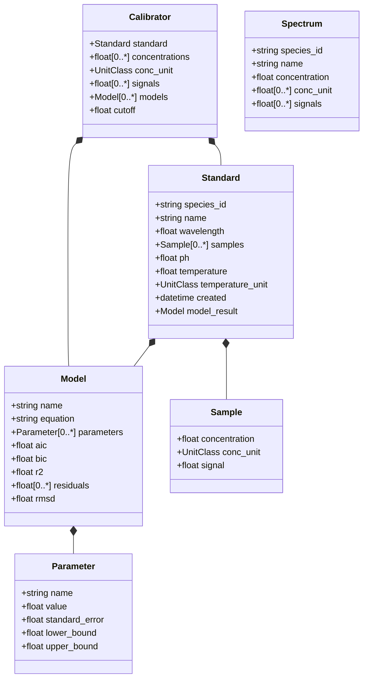

```mermaid
classDiagram
    Calibrator *-- Standard
    Calibrator *-- Model
    Standard *-- Sample
    Standard *-- Model
    Model *-- Parameter
    
    class Calibrator {
        +Standard standard
        +float[0..*] concentrations
        +UnitClass conc_unit
        +float[0..*] signals
        +Model[0..*] models
        +float cutoff
    }
    
    class Standard {
        +string species_id
        +string name
        +float wavelength
        +Sample[0..*] samples
        +float ph
        +float temperature
        +UnitClass temperature_unit
        +datetime created
        +Model model_result
    }
    
    class Sample {
        +float concentration
        +UnitClass conc_unit
        +float signal
    }
    
    class Model {
        +string name
        +string equation
        +Parameter[0..*] parameters
        +float aic
        +float bic
        +float r2
        +float[0..*] residuals
        +float rmsd
    }
    
    class Parameter {
        +string name
        +float value
        +float standard_error
        +float lower_bound
        +float upper_bound
    }
    
    class Spectrum {
        +string species_id
        +string name
        +float concentration
        +float[0..*] conc_unit
        +float[0..*] signals
    }
    
```