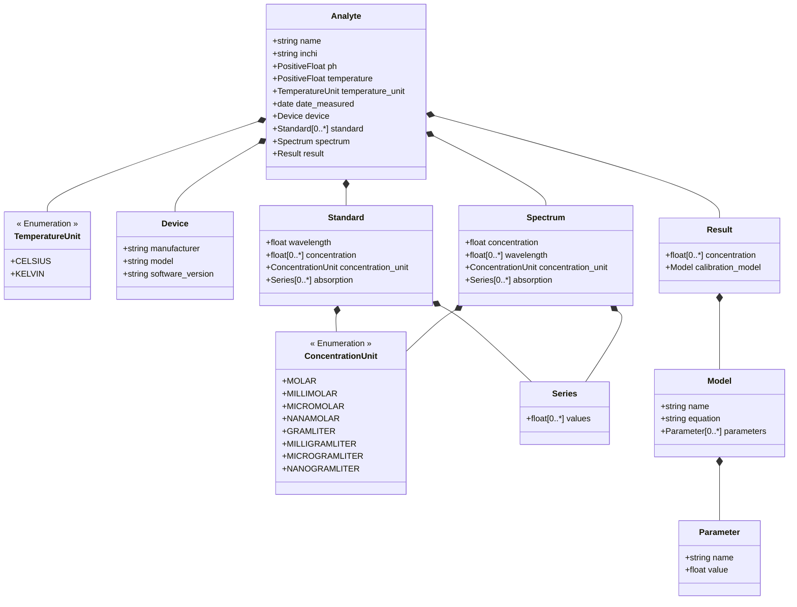

```mermaid
classDiagram
    Analyte *-- TemperatureUnit
    Analyte *-- Device
    Analyte *-- Standard
    Analyte *-- Spectrum
    Analyte *-- Result
    Standard *-- ConcentrationUnit
    Standard *-- Series
    Spectrum *-- ConcentrationUnit
    Spectrum *-- Series
    Result *-- Model
    Model *-- Parameter
    
    class Analyte {
        +string name
        +string inchi
        +PositiveFloat ph
        +PositiveFloat temperature
        +TemperatureUnit temperature_unit
        +date date_measured
        +Device device
        +Standard[0..*] standard
        +Spectrum spectrum
        +Result result
    }
    
    class Device {
        +string manufacturer
        +string model
        +string software_version
    }
    
    class Standard {
        +float wavelength
        +float[0..*] concentration
        +ConcentrationUnit concentration_unit
        +Series[0..*] absorption
    }
    
    class Spectrum {
        +float concentration
        +float[0..*] wavelength
        +ConcentrationUnit concentration_unit
        +Series[0..*] absorption
    }
    
    class Result {
        +float[0..*] concentration
        +Model calibration_model
    }
    
    class Model {
        +string name
        +string equation
        +Parameter[0..*] parameters
    }
    
    class Parameter {
        +string name
        +float value
    }
    
    class Series {
        +float[0..*] values
    }
    
    class TemperatureUnit {
        << Enumeration >>
        +CELSIUS
        +KELVIN
    }
    
    class ConcentrationUnit {
        << Enumeration >>
        +MOLAR
        +MILLIMOLAR
        +MICROMOLAR
        +NANAMOLAR
        +GRAMLITER
        +MILLIGRAMLITER
        +MICROGRAMLITER
        +NANOGRAMLITER
    }
    
```