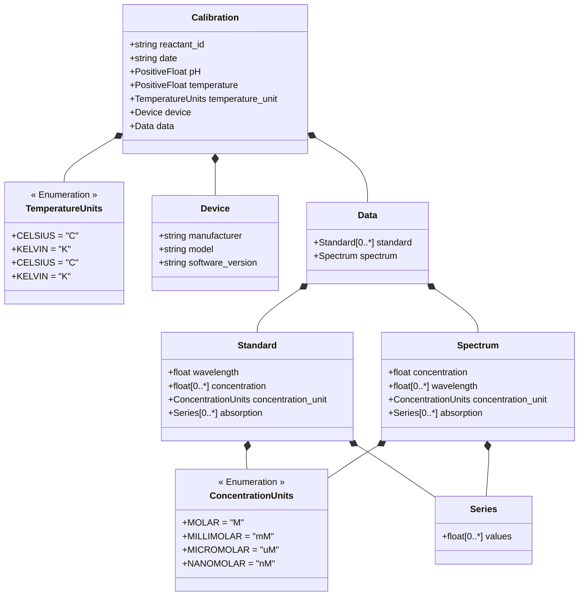

```mermaid
classDiagram
    Calibration *-- TemperatureUnits
    Calibration *-- Device
    Calibration *-- Data
    Data *-- Standard
    Data *-- Spectrum
    Standard *-- ConcentrationUnits
    Standard *-- Series
    Spectrum *-- ConcentrationUnits
    Spectrum *-- Series
    
    class Calibration {
        +string reactant_id
        +string date
        +PositiveFloat pH
        +PositiveFloat temperature
        +TemperatureUnits temperature_unit
        +Device device
        +Data data
    }
    
    class Device {
        +string manufacturer
        +string model
        +string software_version
    }
    
    class Data {
        +Standard[0..*] standard
        +Spectrum spectrum
    }
    
    class Standard {
        +float wavelength
        +float[0..*] concentration
        +ConcentrationUnits concentration_unit
        +Series[0..*] absorption
    }
    
    class Spectrum {
        +float concentration
        +float[0..*] wavelength
        +ConcentrationUnits concentration_unit
        +Series[0..*] absorption
    }
    
    class Series {
        +float[0..*] values
    }
    
    class TemperatureUnits {
        << Enumeration >>
        +CELSIUS = "C"
        +KELVIN = "K"
    }
    
    class TemperatureUnits {
        << Enumeration >>
        +CELSIUS = "C"
        +KELVIN = "K"
    }
    
    class ConcentrationUnits {
        << Enumeration >>
        +MOLAR = "M"
        +MILLIMOLAR = "mM"
        +MICROMOLAR = "uM"
        +NANOMOLAR = "nM"
    }
    
```