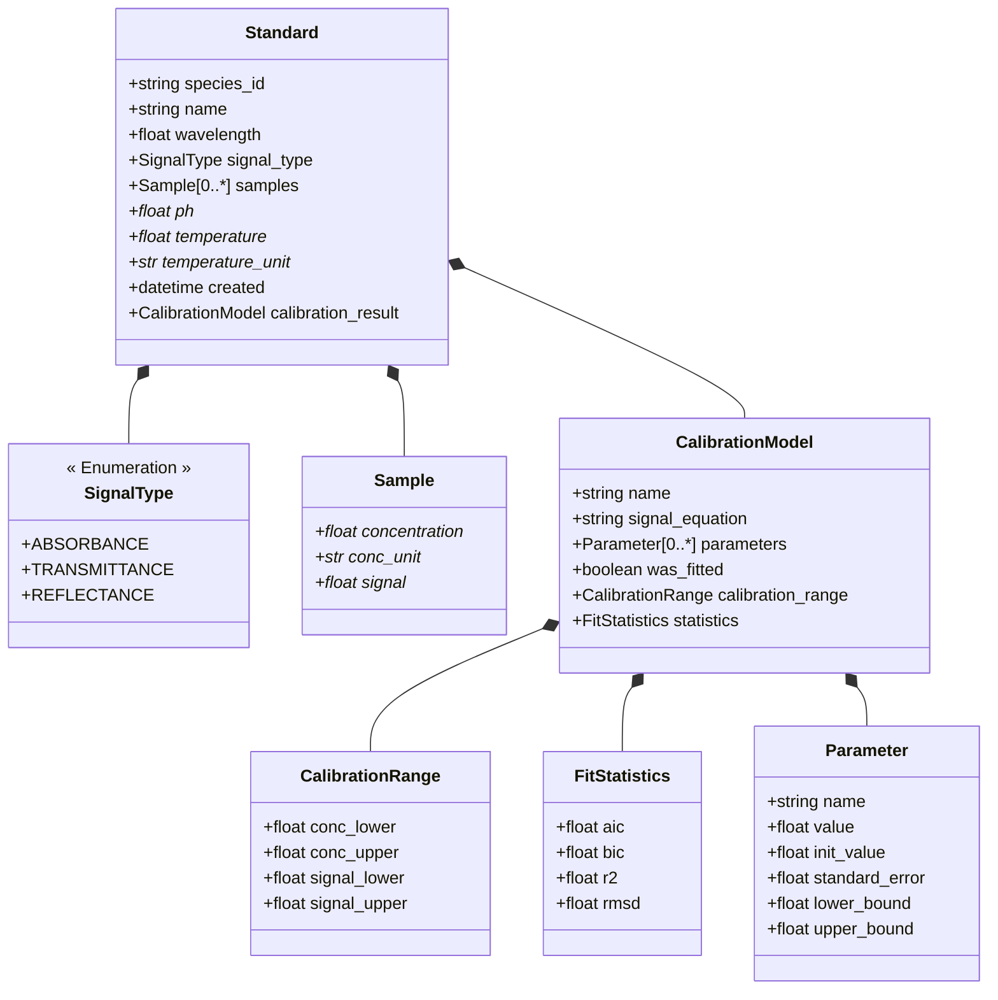

```mermaid
classDiagram
    Standard *-- SignalType
    Standard *-- Sample
    Standard *-- CalibrationModel
    CalibrationModel *-- CalibrationRange
    CalibrationModel *-- FitStatistics
    CalibrationModel *-- Parameter
    
    class Standard {
        +string species_id
        +string name
        +float wavelength
        +SignalType signal_type
        +Sample[0..*] samples
        +float ph*
        +float temperature*
        +str temperature_unit*
        +datetime created
        +CalibrationModel calibration_result
    }
    
    class Sample {
        +float concentration*
        +str conc_unit*
        +float signal*
    }
    
    class CalibrationModel {
        +string name
        +string signal_equation
        +Parameter[0..*] parameters
        +boolean was_fitted
        +CalibrationRange calibration_range
        +FitStatistics statistics
    }
    
    class CalibrationRange {
        +float conc_lower
        +float conc_upper
        +float signal_lower
        +float signal_upper
    }
    
    class FitStatistics {
        +float aic
        +float bic
        +float r2
        +float rmsd
    }
    
    class Parameter {
        +string name
        +float value
        +float init_value
        +float standard_error
        +float lower_bound
        +float upper_bound
    }
    
    class SignalType {
        << Enumeration >>
        +ABSORBANCE
        +TRANSMITTANCE
        +REFLECTANCE
    }
    
```