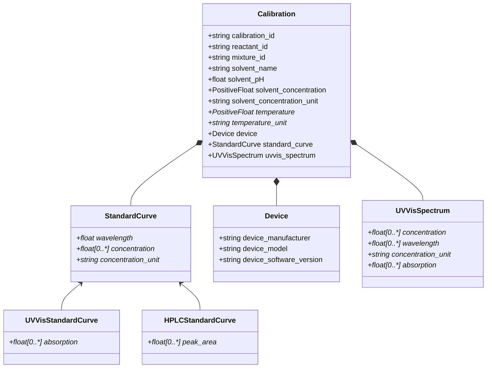

```mermaid
classDiagram
    StandardCurve <-- UVVisStandardCurve
    StandardCurve <-- HPLCStandardCurve
    Calibration *-- Device
    Calibration *-- StandardCurve
    Calibration *-- UVVisSpectrum
    
    class Calibration {
        +string calibration_id
        +string reactant_id
        +string mixture_id
        +string solvent_name
        +float solvent_pH
        +PositiveFloat solvent_concentration
        +string solvent_concentration_unit
        +PositiveFloat temperature*
        +string temperature_unit*
        +Device device
        +StandardCurve standard_curve
        +UVVisSpectrum uvvis_spectrum
    }
    
    class Device {
        +string device_manufacturer
        +string device_model
        +string device_software_version
    }
    
    class StandardCurve {
        +float wavelength*
        +float[0..*] concentration*
        +string concentration_unit*
    }
    
    class UVVisStandardCurve {
        +float[0..*] absorption*
    }
    
    class HPLCStandardCurve {
        +float[0..*] peak_area*
    }
    
    class UVVisSpectrum {
        +float[0..*] concentration*
        +float[0..*] wavelength*
        +string concentration_unit*
        +float[0..*] absorption*
    }
    
```