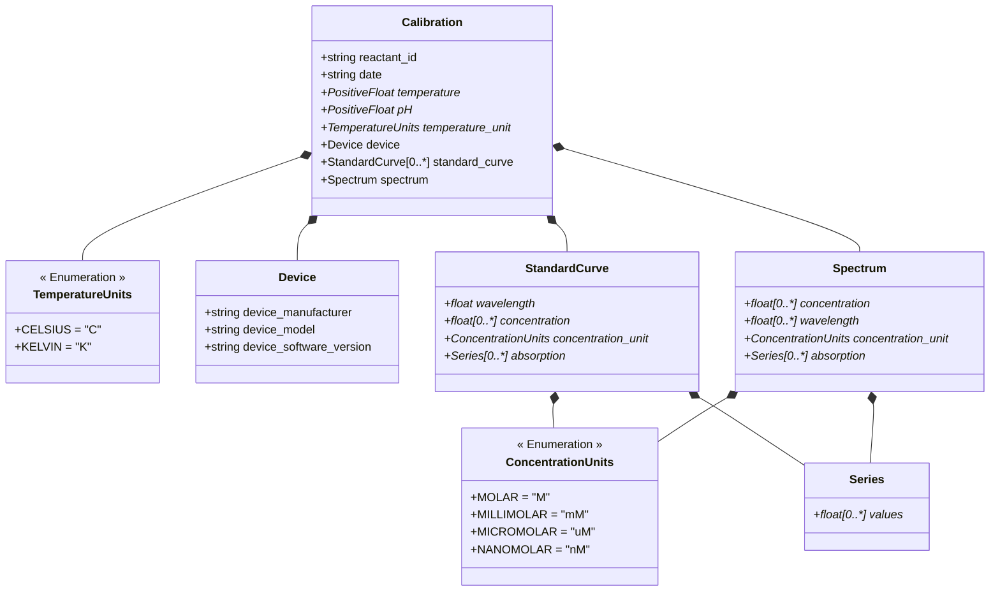

```mermaid
classDiagram
    Calibration *-- TemperatureUnits
    Calibration *-- Device
    Calibration *-- StandardCurve
    Calibration *-- Spectrum
    StandardCurve *-- ConcentrationUnits
    StandardCurve *-- Series
    Spectrum *-- ConcentrationUnits
    Spectrum *-- Series
    
    class Calibration {
        +string reactant_id
        +string date
        +PositiveFloat temperature*
        +PositiveFloat pH*
        +TemperatureUnits temperature_unit*
        +Device device
        +StandardCurve[0..*] standard_curve
        +Spectrum spectrum
    }
    
    class Device {
        +string device_manufacturer
        +string device_model
        +string device_software_version
    }
    
    class StandardCurve {
        +float wavelength*
        +float[0..*] concentration*
        +ConcentrationUnits concentration_unit*
        +Series[0..*] absorption*
    }
    
    class Spectrum {
        +float[0..*] concentration*
        +float[0..*] wavelength*
        +ConcentrationUnits concentration_unit*
        +Series[0..*] absorption*
    }
    
    class Series {
        +float[0..*] values*
    }
    
    class TemperatureUnits {
        << Enumeration >>
        +CELSIUS = "C"
        +KELVIN = "K"
    }
    
    class ConcentrationUnits {
        << Enumeration >>
        +MOLAR = "M"
        +MILLIMOLAR = "mM"
        +MICROMOLAR = "uM"
        +NANOMOLAR = "nM"
    }
    
```